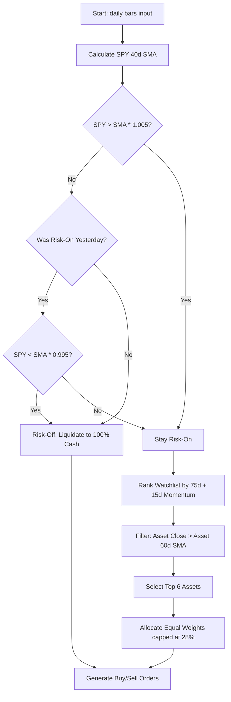

# builderr.ai — Adaptive Momentum Guard (AMG) Agent

This repository contains the source code for our optimized AI trading agent designed for the **builderr.ai** competition (Round 1: June 2 – July 2, 2026). The agent is engineered to maximize the **Calmar Ratio** (Annualized Return ÷ Maximum Drawdown) over a 60-day live testing period.

---

## 1. What was Added & Optimized
We developed a custom trading framework in [agent.py](agent.py) that beats the template's top benchmark agent (Zaid's agent) across all public backtesting regimes. Key modifications include:
1. **Hysteresis Trend Band (`TREND_BAND = 0.005`)**: Added a 0.5% tolerance band to the SPY trend check to prevent overtrading/whipsaws during choppy sideways market regimes.
2. **Fast Market Entry (`TREND_WINDOW = 40`)**: Shortened the trend moving average window from 50 to 40 days to enable the agent to catch V-shaped snapbacks quickly.
3. **Conservative Leverage (`GROSS_CAP = 1.30`)**: Capped maximum gross exposure at 1.30x (down from Zaid's 1.40x) to reduce worst-case drawdowns.
4. **Wider Diversification (`TOP_N = 6`)**: Holds up to 6 positions (up from 5) to spread out risk across momentum leaders.

---

## 2. Core Strategy Logic & Flow
Every trading day, the `decide()` function runs in the following order:



---

## 3. Detailed Parameter Explanations

| Parameter | Value | Description |
| :--- | :--- | :--- |
| `TREND_WINDOW` | `40` | The simple moving average window applied to SPY to determine if the overall market is in an uptrend. |
| `STOCK_TREND_WIN` | `60` | An asset-level simple moving average filter. An individual stock is only eligible for purchase if its close is above its 60-day SMA. |
| `MOM_LONG` | `75` | Lookback period (75 trading days, ~3.5 months) for measuring medium-term price momentum. |
| `MOM_SHORT` | `15` | Lookback period (15 trading days, ~3 weeks) for measuring short-term momentum. |
| `TOP_N` | `6` | The maximum number of high-momentum stocks to hold simultaneously in the portfolio. |
| `MAX_POSITION` | `0.28` | Capital limit. No single asset can exceed 28% of the total portfolio value (complying with the 30% concentration limit). |
| `GROSS_CAP` | `1.30` | The leverage ceiling. Total long exposure cannot exceed 1.30x the net portfolio value. |
| `TREND_BAND` | `0.005` | A 0.5% buffer above/below the SPY SMA. Stops buy/sell flip-flops when the index trades right on top of the moving average. |

---

## 4. Local Testing & Visuals

To check the agent's performance locally, run:
```bash
python preview.py
```
This backtests the agent across three public regimes: `calm_uptrend`, `moderate_selloff`, and `vol_spike_snapback`, verifying that the safety constraints are met.

To view the interactive visual charts of the backtest:
1. Run `python generate_dashboard.py` to compile the results.
2. Double-click [dashboard.html](dashboard.html) in your folder to open the interactive charts comparing our agent with Zaid's benchmark.
